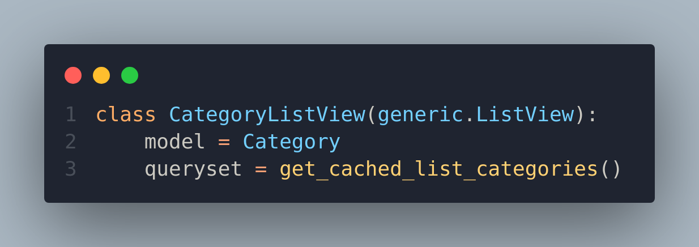

# Краткое описание

Задание 1.
Добавлена возможность создавать продукт, добавлена проверка на стоп-слова в названии и описании продукта

Задание 2. Добавлена модель версии продукта.
Название и номер активной версии (is_current) отображаются в карточке товара
 

Задание 3. Добавлена форма для работы с версиями продукта и отображением списоком версий. (* в один момент времени может быть не больше одной активной версии)

* 