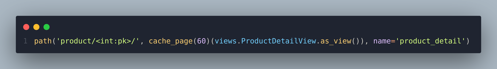

## Задание 1. :white_check_mark:

Продолжаем работать с проектом. Установите брокер для кеширования Redis. Внесите необходимые настройки и проверьте работоспособность проекта с новыми настройками. 

## Задание 2 :white_check_mark:

Настройте кеширование всего контроллера отображения данных относительно одного продукта.

## Задание 3 :white_check_mark:

Создайте сервисную функцию, которая будет отвечать за выборку категорий и которую можно переиспользовать в любом месте системы. Добавьте низкоуровневое кеширование для списка категорий.

## Задание 4 :white_check_mark:

Вынесите необходимые настройки в переменные окружения и настройте проект для работы с ними.

