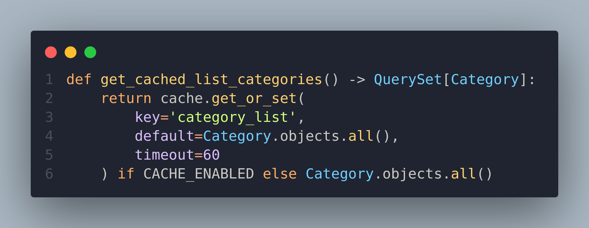

## Задание 1.
Создайте новое приложения для работы с пользователем. Определите собственную модель для пользователя, при этом задайте электронную почту как поле для авторизации.

## Задание 2.
В сервисе реализуйте функционал аутентификации, а именно:
* Регистрация пользователя по почте и паролю. 
* Верификация почты пользователя через отправленное письмо.
* Авторизация пользователя.
* Восстановление пароля зарегистрированного пользователя на автоматически сгенерированный пароль.

## Задание 3.
Все контроллеры, которые отвечают за работу с продуктами, закройте для анонимных пользователей, при этом создаваемые продукты должны автоматически привязываться к авторизованному пользователю.

